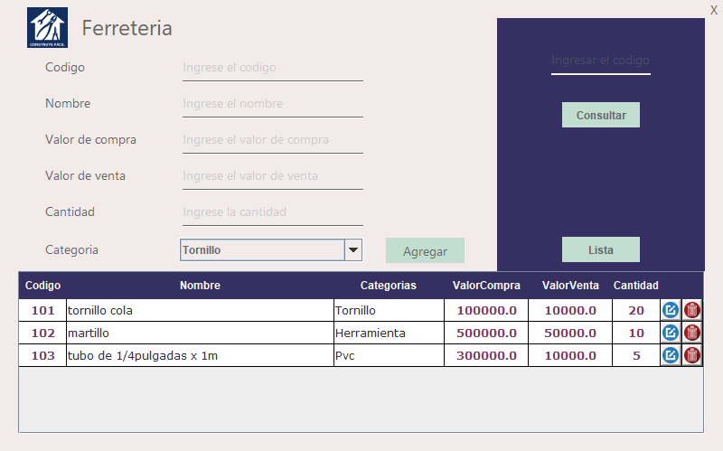

<h1>CRUD_Ferreteria </h1>

El proyecto FerreteríaCRUD es una aplicación de gestión de inventario desarrollada en Java utilizando el entorno de desarrollo Apache NetBeans. Esta aplicación permite a una ferretería llevar un control eficiente de su inventario, gestionar productos, realizar operaciones de creación, lectura, actualización y eliminación (CRUD), y mantener un registro detallado de sus productos y existencias de manera intuitiva y amigable.
